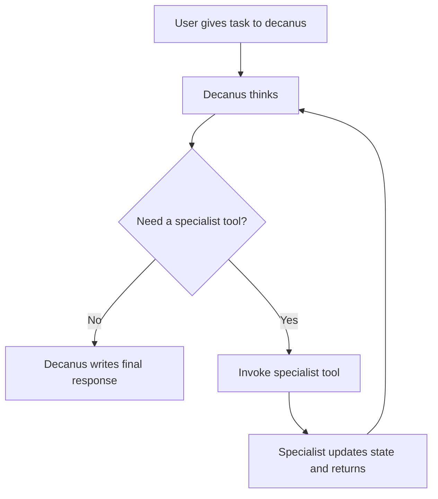

# Contubernium Agent Loop

Contubernium runs as a commander-led tool loop.



The loop is always:

`Think -> Tool Call -> Tool Result -> Think -> Finish`

## Core Rules

1. `decanus` always receives the initial user prompt.
2. `decanus` owns planning, routing, and the final response.
3. Every other agent is a callable tool with a narrow specialty.
4. Tool calls must be written into `contubernium_state.json` before handoff.
5. Specialists must return control to `decanus` after each invocation.

## State Contract

`mission`
- Stores the original prompt, current goal, success criteria, constraints, and final response.

`agent_loop`
- Tracks loop status, iteration count, active tool, latest decision, latest tool result, and event history.

`agent_tools`
- Lists the callable specialist roster, the lane each tool owns, and when the tool should be used.

`tasks.<lane>.invocation`
- Holds the live tool contract for a specialist:
  - `status`
  - `requested_by`
  - `iteration`
  - `objective`
  - `completion_signal`
  - `dependencies`
  - `result_summary`
  - `return_to`

## Invocation Lifecycle

1. `decanus` reads the current mission and decides whether to finish or call a tool.
2. If a tool is needed, `decanus` writes the invocation contract into the lane owned by that specialist.
3. `decanus` sets `agent_loop.active_tool`, appends a `tool_call` event, and updates `current_actor`.
4. The specialist completes the scoped work, records artifacts and a `result_summary`, then returns control to `decanus`.
5. `decanus` records a `tool_result` event, reassesses the mission, and either calls another tool or finishes.

## Recommended Status Values

`global_status`
- `idle`
- `planning`
- `waiting_on_tool`
- `complete`

`agent_loop.status`
- `awaiting_initial_prompt`
- `thinking`
- `running_tool`
- `complete`

`tasks.<lane>.invocation.status`
- `idle`
- `ready`
- `running`
- `complete`
- `blocked`

## History Entries

Each `agent_loop.history` entry should be a compact JSON object with fields such as:

```json
{
  "iteration": 2,
  "type": "tool_result",
  "actor": "faber",
  "lane": "backend",
  "summary": "API route and schema added.",
  "artifacts": ["api/routes/report.ts"]
}
```
