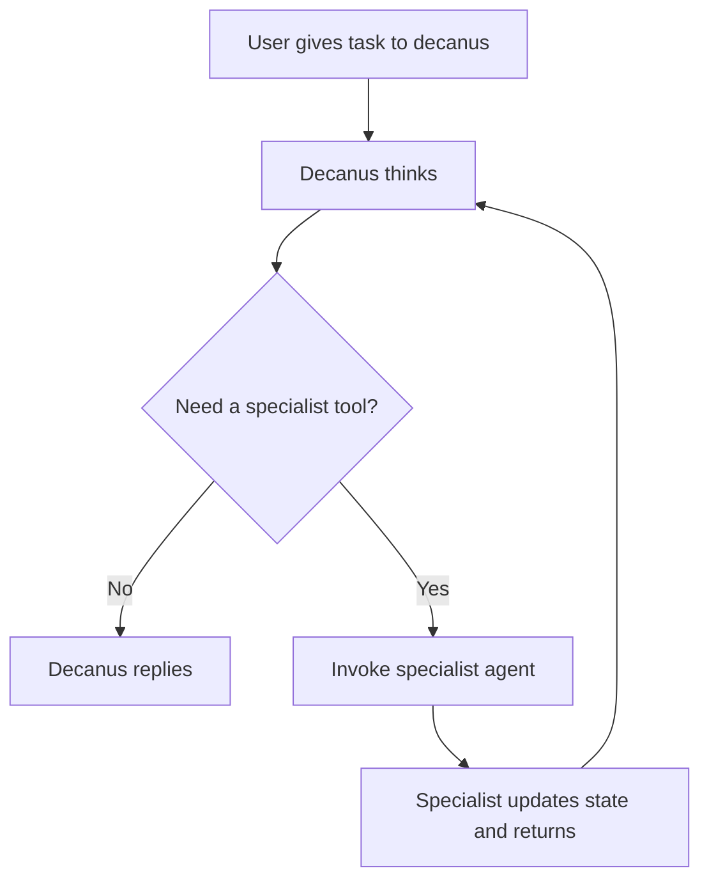

# Contubernium

**Contubernium** is a 10-agent localized workspace scaffold for complex development work using a disciplined Roman command structure. The operating model is commander-first: `decanus` always receives the initial prompt, then loops through the specialist roster as callable tools until the mission is complete.

## 🚀 Current Status

- **Project Scaffolding Complete**: The foundational directory structure for the 10-agent contubernium is established under `.agents/`.
- **Agent Personas Defined**: Skill definitions (`SKILL.md`) for all 10 agents are maintained within their respective directories.
- **Loop-Aware State Management**: The project-local JSON state manager (`.contubernium/state.json`) now tracks the mission, the active loop, and per-tool invocations.
- **Deployment Script Standardized**: `init.sh` hydrates the Roman roster and protects existing project state from being overwritten.
- **Local Runtime Added**: A Zig CLI now provides a standalone runner for local-model execution against Ollama first, then OpenAI-compatible local backends.
- **Persistent Runtime Docs Added**: The local-model plan, runtime spec, and operations guide now live in `docs/` and are linked below.

## 🤖 The Roster

The workspace is powered by 8 core legionaries and 2 auxiliaries. `decanus` is the orchestrator; the remaining agents operate as specialist tools inside the commander loop.

1. **decanus**: The state commander who reads the mission, assigns work, and updates `.contubernium/state.json`.
2. **faber**: The backend blacksmith who builds databases, APIs, and server logic.
3. **artifex**: The frontend artisan who builds the interface and connects client behavior to the backend.
4. **architectus**: The systems siege-engineer who manages infrastructure, CI/CD, and deployment scripts.
5. **tesserarius**: The QA gatekeeper who reviews work for security, logic, regressions, and performance issues.
6. **explorator**: The research scout who gathers technical docs, API specs, and external intelligence.
7. **signifer**: The brand standard-bearer who enforces visual identity and design discipline.
8. **praeco**: The media herald who writes launch copy, release notes, and social strategy.
9. **calo**: The documentation scribe who updates READMEs, markdown docs, and supporting comments after changes land.
10. **mulus**: The pack mule who handles bulk formatting, asset conversion, and high-volume file operations.

## Loop Model

Contubernium follows a simple agent loop:



The mental model is:

`Think -> Tool -> Result -> Think -> Finish`

In practice:

1. The user prompt goes to `decanus`.
2. `decanus` writes the mission into `.contubernium/state.json`.
3. `decanus` decides whether to answer directly or invoke a specialist lane.
4. The chosen specialist completes the scoped invocation and returns control to `decanus`.
5. `decanus` either invokes the next tool or writes the final response.

## 🛠️ Quick Start

Prerequisites:

- `git`
- `zig 0.15.2`

Quick install from GitHub:

```bash
curl -fsSL https://raw.githubusercontent.com/scwlkr/contubernium/main/install.sh | bash
```

The installer builds the CLI and installs `contubernium` into `~/.local/bin` by default, or `~/bin` if that directory is already on your `PATH`. If the install directory is not on your `PATH`, the script prints the exact `export` line to add.

To start Contubernium in any project directory:

```bash
cd ~/Desktop/dev/test_deez
contubernium
```

On first run, `contubernium` creates `.contubernium/` in the current directory and writes:

- `.contubernium/config.json`
- `.contubernium/state.json`
- `.contubernium/prompts/`
- `.contubernium/logs/`

If you want to scaffold the project files without opening the interactive UI, run:

```bash
contubernium init
```

If you prefer to install from a local clone instead of the one-line GitHub bootstrap:

```bash
git clone https://github.com/scwlkr/contubernium.git
cd contubernium
./install.sh
```

If you still want the older bootstrap script that symlinks shared assets into a workspace, you can run `./init.sh` from a local clone.

## Local Model Runtime

Contubernium now includes a standalone Zig CLI for running the commander/specialist loop against local models from any project directory.

Main commands:

```bash
zig build test
contubernium
contubernium init
contubernium doctor
contubernium models list
contubernium run "your mission prompt"
contubernium step
contubernium resume
contubernium ui
contubernium
```

What `contubernium init` creates in the current project:

- `.contubernium/config.json`
- `.contubernium/state.json`
- `.contubernium/prompts/`
- `.contubernium/logs/`

Running `contubernium` with no arguments initializes `.contubernium/` if needed and starts the full-screen Roman-styled TUI. Running `contubernium ui` does the same thing explicitly. Running `contubernium init` only writes the runtime scaffold.

Validation:

- `zig build` compiles the runtime
- `zig build test` runs the TUI/layout, streaming parser, and helper unit tests

Inside the TUI you can:

- enter a mission prompt directly
- watch the active agent stream JSON output into the mission log while the UI stays responsive
- see live state context for `global_status`, `current_actor`, loop iteration, lane, model, and last error in the header/sidebar
- run `/doctor` to verify the local backend
- run `/models` to query the active local model roster
- run `/model <n|name>` to switch the active local model without leaving the UI
- run `/status`, `/resume`, `/interrupt`, `/clear`, or `/exit`
- approve guarded writes or shell actions with `y` / `n` when the runtime asks for confirmation

Keyboard controls:

- `Enter` submits the current prompt or slash command
- `Up` / `Down` scroll the mission log
- `PageUp` / `PageDown` scroll faster
- `Left` / `Right` move within the input field
- `Ctrl+C` interrupts the active loop or exits when idle

Implementation note:

- The MVP ships as a raw ANSI Zig TUI with a background worker thread and Ollama chunk streaming. It keeps dependencies at zero for now while leaving room for a future move to a richer library such as `vaxis` if the widget surface grows.

The first implementation target is Ollama. The runtime also includes an OpenAI-compatible adapter layer so it can be extended to other local servers without changing the Contubernium protocol.

Reference docs:

- [Local LLM plan](docs/local-llm-contubernium-plan.md)
- [Runtime spec](docs/local-llm-runtime-spec.md)
- [Operations guide](docs/local-llm-operations.md)

## 📄 State Tracking

Contubernium relies on `.contubernium/state.json` to monitor the overarching project. It tracks:
- `project_name`
- `global_status`
- `current_actor`
- `mission`, including the initial user prompt and final response
- `agent_loop`, including iteration count, active tool, and loop history
- `runtime_session`, including provider, model, endpoint, approval mode, and the active turn log
- `agent_tools`, which describes when each specialist should be used
- Task lanes for backend, frontend, systems, QA, research, brand, media, documentation, and bulk operations
- Per-lane `invocation` contracts so specialists behave like tools and always return control to `decanus`

For the detailed operating contract, see `.agents/AGENT_LOOP.md`.
