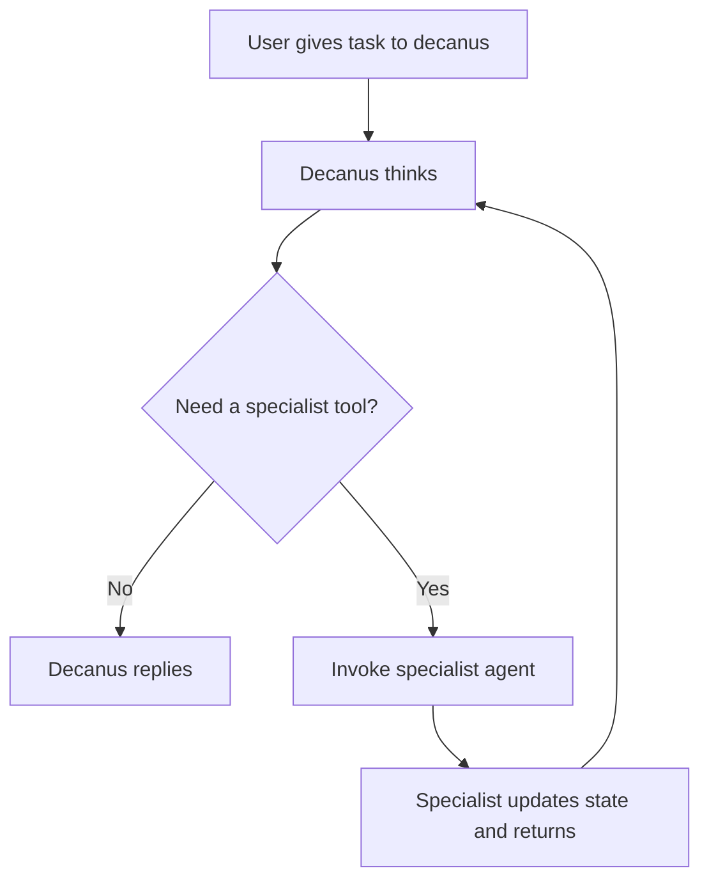

# Contubernium

**Contubernium** is a 10-agent localized workspace scaffold for complex development work using a disciplined Roman command structure. The operating model is commander-first: `decanus` always receives the initial prompt, then loops through the specialist roster as callable tools until the mission is complete.

## 🚀 Current Status

- **Project Scaffolding Complete**: The foundational directory structure for the 10-agent contubernium is established under `.agents/`.
- **Agent Personas Defined**: Skill definitions (`SKILL.md`) for all 10 agents are maintained within their respective directories.
- **Loop-Aware State Management**: The local JSON state manager (`contubernium_state.json`) now tracks the mission, the active loop, and per-tool invocations.
- **Deployment Script Standardized**: `init.sh` hydrates the Roman roster and protects existing project state from being overwritten.

## 🤖 The Roster

The workspace is powered by 8 core legionaries and 2 auxiliaries. `decanus` is the orchestrator; the remaining agents operate as specialist tools inside the commander loop.

1. **decanus**: The state commander who reads the mission, assigns work, and updates `contubernium_state.json`.
2. **faber**: The backend blacksmith who builds databases, APIs, and server logic.
3. **artifex**: The frontend artisan who builds the interface and connects client behavior to the backend.
4. **architectus**: The systems siege-engineer who manages infrastructure, CI/CD, and deployment scripts.
5. **tesserarius**: The QA gatekeeper who reviews work for security, logic, regressions, and performance issues.
6. **explorator**: The research scout who gathers technical docs, API specs, and external intelligence.
7. **signifer**: The brand standard-bearer who enforces visual identity and design discipline.
8. **praeco**: The media herald who writes launch copy, release notes, and social strategy.
9. **calo**: The documentation scribe who updates READMEs, markdown docs, and supporting comments after changes land.
10. **mulus**: The pack mule who handles bulk formatting, asset conversion, and high-volume file operations.

## Loop Model

Contubernium follows a simple agent loop:



The mental model is:

`Think -> Tool -> Result -> Think -> Finish`

In practice:

1. The user prompt goes to `decanus`.
2. `decanus` writes the mission into `contubernium_state.json`.
3. `decanus` decides whether to answer directly or invoke a specialist lane.
4. The chosen specialist completes the scoped invocation and returns control to `decanus`.
5. `decanus` either invokes the next tool or writes the final response.

## 🛠️ Usage

To initialize the swarm in a target directory (assuming Contubernium is your global reference):

```bash
/path/to/Contubernium/init.sh
```

This script will:
1. Safely symlink the `.agents` directory to your local working directory.
2. Copy `templates/contubernium_state.template.json` into a local `contubernium_state.json`.
3. Start the workspace in a commander-first loop with `current_actor` set to `decanus`.

## 📄 State Tracking

Contubernium relies on `contubernium_state.json` to monitor the overarching project. It tracks:
- `project_name`
- `global_status`
- `current_actor`
- `mission`, including the initial user prompt and final response
- `agent_loop`, including iteration count, active tool, and loop history
- `agent_tools`, which describes when each specialist should be used
- Task lanes for backend, frontend, systems, QA, research, brand, media, documentation, and bulk operations
- Per-lane `invocation` contracts so specialists behave like tools and always return control to `decanus`

For the detailed operating contract, see `.agents/AGENT_LOOP.md`.
